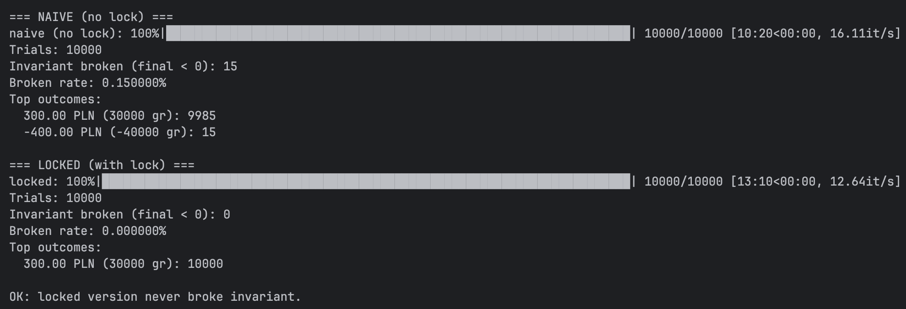
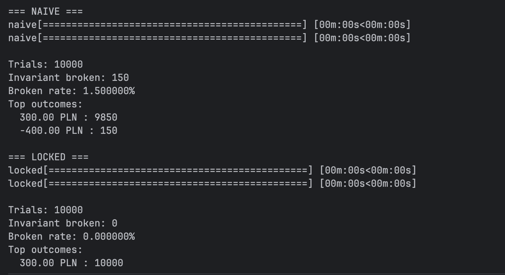
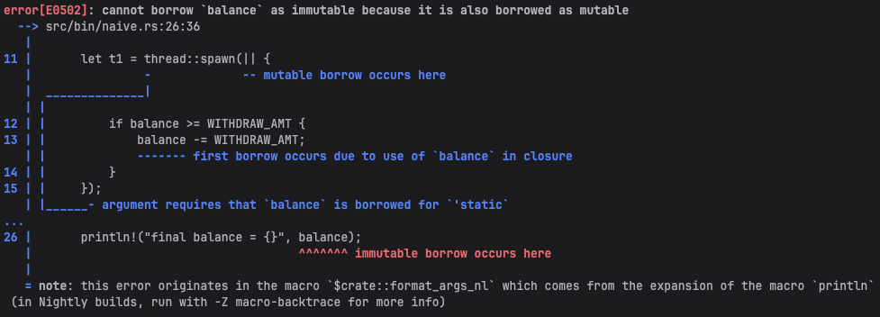
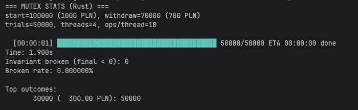
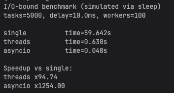

# Finance Concurrency Demo

Demonstration of race conditions and concurrency models across **Python, Rust, and C++**,  
with an additional deep dive into **CPU-bound vs I/O-bound concurrency in Python**.

The project shows:
- how race conditions appear in practice,
- how they can be fixed with synchronization,
- and how different languages and runtime models approach concurrency and safety.

## What’s inside

- **Python**
  - `python/naive.py` — race condition on shared state
  - `python/locked.py` — fixed version using a lock
  - `python/stats_test.py` — basic invariant checks

- **C++**
  - `cpp/src/main.cpp` — concurrency scenarios and statistics
  - `cpp/include/` — model, scenarios, and stats
  - `cpp/tests/test_invariants.cpp` — invariant tests

- **Rust**
  - `rust/src/bin/naive.rs` — intentionally invalid (rejected by the compiler)
  - `rust/src/bin/mutex_stats.rs` — correct shared-state synchronization and statistics

- **Part two: Python concurrency models**
  - `part-two/cpu_bench.py` — CPU-bound workload (threads vs processes)
  - `part-two/io_bench.py` — I/O-bound workload (threads vs asyncio)

## Repository structure

```text
python/
cpp/
rust/
part-two/
docs/img/        # screenshots used in this README
```

## Quick start

### Python — race condition demo

Naive version (race condition):
```bash
python3 python/naive.py
```

Locked version (fixed):
```bash
python3 python/fixed.py
```

Run invariant/statistics test with a custom number of trials:
```bash
python3 python/stats_test.py --trials 1000
```
Increasing the number of trials makes race conditions more likely
to manifest in the naive implementation.

### Rust

Correct version using a mutex with custom parameters:

```bash
cd rust
 cargo run --bin mutex_stats -- --trials 20000 --threads 2 --ops 1
```

Naive version (expected to fail compilation):
```bash
cargo run --bin naive
```

The naive Rust version is intentionally incorrect and demonstrates how Rust prevents
unsafe shared mutable state at compile time.

### C++

Build and run:

```bash
cd cpp
cmake -S . -B build -DCMAKE_BUILD_TYPE=Release
cmake --build build
./build/finance_concurrency_cpp
```

Run tests:

```bash
./build/finance_concurrency_tests
# or
ctest --test-dir build
```

### Python — Part two (concurrency models)

CPU-bound benchmark:
```bash
python3 part-two/cpu_bench.py --end 200000 --workers 8
```

I/O-bound benchmark:
```bash
python3 part-two/io_bench.py --tasks 500 --delay_ms 10 --workers 100
```

## What this project demonstrates
### Race condition (naive)

Multiple threads modify shared mutable state without synchronization.
The result is non-deterministic — sometimes correct, sometimes incorrect.

### Fixed version (lock / mutex)

A critical section is protected with a lock or mutex.
This guarantees correctness and deterministic results at the cost of some overhead.

### Rust perspective

In Rust, the naive approach often does not compile at all.
Sharing mutable state across threads requires explicit synchronization
(e.g. `Arc<Mutex<T>>`), moving an entire class of concurrency bugs
from runtime to compile time.

### Part two: Python concurrency models
#### CPU-bound workloads

- `ThreadPoolExecutor` does not scale for CPU-bound work due to the GIL
- `ProcessPoolExecutor` can scale by using multiple processes

#### I/O-bound workloads

- Threads can improve throughput while waiting on I/O
- `asyncio` efficiently handles many concurrent I/O-bound tasks
## Results (screenshots)

### Python: naive vs locked


### C++: naive vs locked


### Rust: compile-time rejection and mutex



### Python concurrency benchmarks

